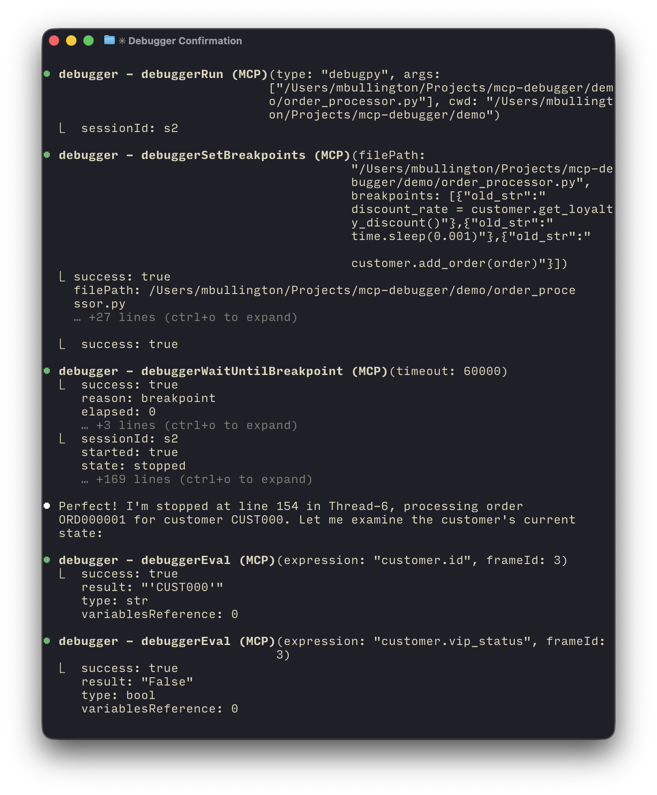

# MCP Debugger



An Model Context Protocol (MCP) server that provides debugging capabilities for Python, C, C++, Rust, Swift, and more through the [Debug Adapter Protocol (DAP)](https://microsoft.github.io/debug-adapter-protocol//).

- Get breakpoints, step-by-step evaluation, and segfault stack traces.
- Read program stdout/stderr in pages (lines: 0-100, etc...) without flooding the context window.
- Programs run async, debug multiple applications at once.

## Installation

Cursor:

[](https://cursor.com/en-US/install-mcp?name=Debugger&config=eyJjb21tYW5kIjoibnB4IC15IG1jcC1kZWJ1Z2dlci1kYXBAbGF0ZXN0In0%3D)

Claude Code:

```sh
claude mcp add --transport stdio Debugger -- npx -y mcp-debugger-dap@latest
```

Manual configuration:

```json
"Debugger": {
  "command": "npx",
  "args": ["-y", "mcp-debugger-dap@latest"]
}
```

## Supported debuggers

`mcp-debugger-dap` supports either Python ([debugpy](https://github.com/microsoft/debugpy)) or **LLDB supported languages** (tested: C, C++, Rust, Swift). Probably more such as Objective-C, Zig, etc... are supported through LLDB.

### Python (debugpy)

Python 3 and `pip` must be installed.

The `debugpy` wheel is automatically downloaded to `~/.mcp-debugger`.

### LLDB

LLDB support requires a recent binary of `lldb-dap`.

**For macOS users:** On macOS Sequoia+ I confirmed tested, before this YMMV, comes included with [XCode Command Line Tools](https://developer.apple.com/xcode/resources/).

**For Linux users:** I recommend the [Helix editor guide](https://github.com/helix-editor/helix/wiki/Debugger-Configurations#installation-instructions) to installing `lldb-dap`.

## Demo

The `demo/` directory contains example scripts demonstrating race conditions and other bugs that can be debugged using this MCP server.

```bash
cd demo
# Use Claude Code or another MCP client to debug:
# "Let's use the debugger to find the race condition in order_processor.py"
```

## References

- [Debug Adapter Protocol Specification](https://microsoft.github.io/debug-adapter-protocol/)
- [Model Context Protocol](https://modelcontextprotocol.io/)
- [debugpy Documentation](https://github.com/microsoft/debugpy)
- [LLDB Documentation](https://lldb.llvm.org/)
